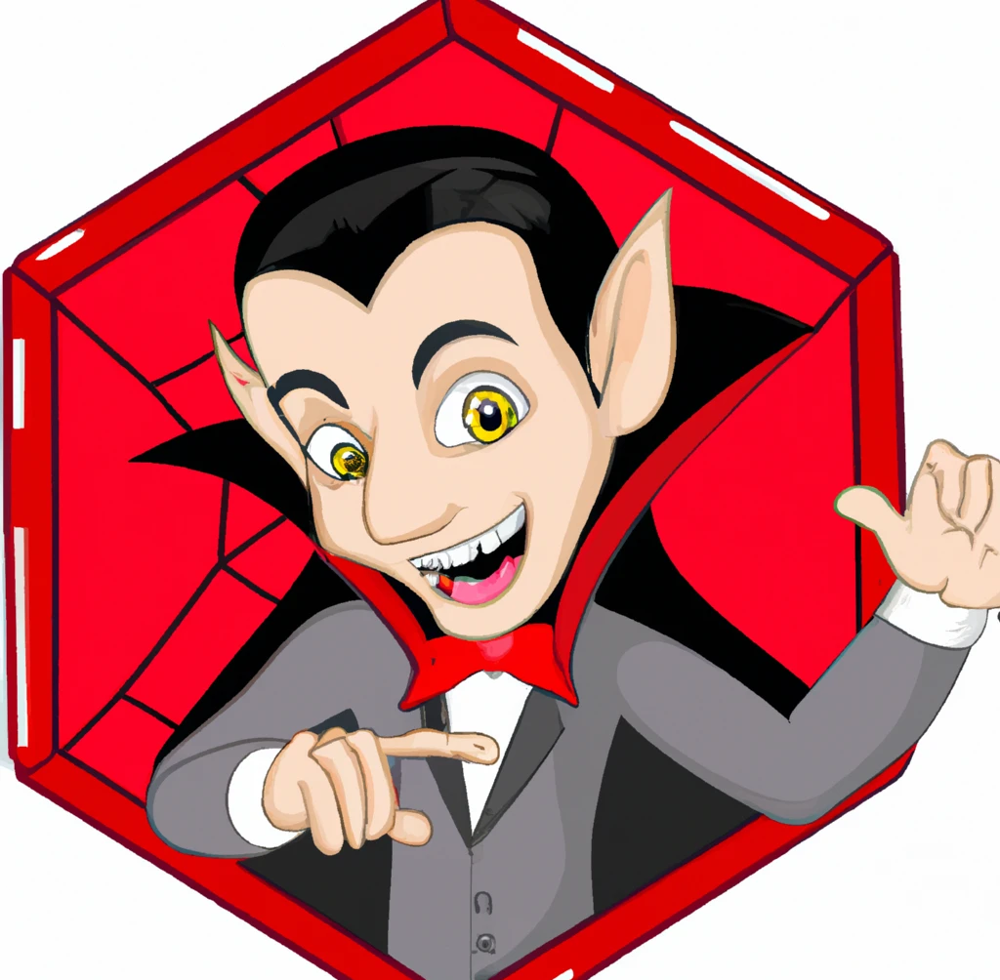

# ggDracula: Dracula for [ggplot2](https://github.com/tidyverse/ggplot2)

> A dark theme for [ggplot2](https://github.com/tidyverse/ggplot2) and `R` palette.

<p align="center">
  
</p>

> _Hex image courtesy of DALL·E 2_

## Install

All instructions can be found at [draculatheme.com/ggplot2](https://draculatheme.com/ggplot2).
```R
devtools::install_github("dracula/ggplot2")
```
or
```R
remotes::install_github("dracula/ggplot2")
```

## Examples

```R
library(dplyr)
library(ggplot2)
library(ggDracula)

set.seed(1)
ggplot(data.frame(x = rnorm(10000), y = rnorm(10000)), aes(x = x, y = y)) +
  geom_hex() + coord_fixed() +
  ggtitle("scale_fill_dracula(discrete = FALSE)") +
  scale_fill_dracula(discrete = FALSE) + theme_dracula()
```


```R
library(dplyr)
library(ggplot2)
library(ggDracula)

dsub <- subset(diamonds, x > 5 & x < 6 & y > 5 & y < 6)
dsub$diff <- with(dsub, sqrt(abs(x - y)) * sign(x - y))

ggplot(dsub, aes(x, y, colour = diff)) +
  geom_point() +
  ggtitle("scale_color_dracula(discrete = FALSE)") +
  scale_color_dracula(discrete = FALSE) +
  theme_dracula()
```


```R
library(dplyr)
library(ggplot2)
library(ggDracula)

mpg %>%
  ggplot(aes(x = displ, y = cty, color = hwy)) +
  geom_point() +
  ggtitle("scale_color_dracula(discrete = TRUE)") +
  scale_color_dracula(discrete = FALSE) +
  theme_dracula()
```


## Team

This theme is maintained by the following person(s) and a bunch of [awesome contributors](https://github.com/dracula/ggplot2/graphs/contributors).

| [](https://github.com/jrdnbradford) |
| --------------------------------------------------------------------------------------------------- |
| [Jordan Bradford](https://github.com/jrdnbradford)                                                  |

## Community

- [Twitter](https://twitter.com/draculatheme) - Best for getting updates about themes and new stuff.
- [GitHub](https://github.com/dracula/dracula-theme/discussions) - Best for asking questions and discussing issues.
- [Discord](https://draculatheme.com/discord-invite) - Best for hanging out with the community.

## Acknowledgments
I'm indebted to the {[viridis](https://sjmgarnier.github.io/viridis)} and {[wesanderson](https://github.com/karthik/wesanderson)} `R` packages for inspiration and several plot examples.

## License

[MIT License](./LICENSE)
