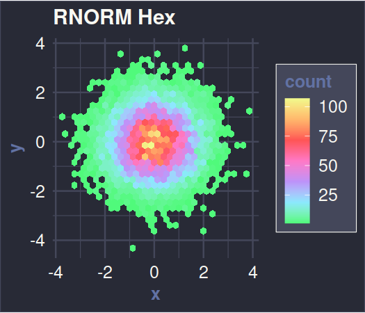
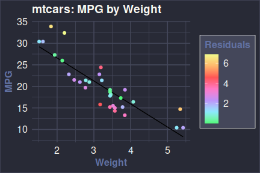

<!-- README.md is rendered from README.qmd. Edit README.qmd and render to update README.md -->

# {`dRacula`} \| Dracula Theme for R <a href="https://draculatheme.com/"></a>

[](https://github.com/dracula/ggplot2/actions/workflows/R-CMD-check.yaml)

> All things Dracula themed for R

## Install

All instructions can be found at
[draculatheme.com/R](https://draculatheme.com/R).

``` r
devtools::install_github("dracula/dRacula")
```

or

``` r
remotes::install_github("dracula/dRacula")
```

## Examples

``` r
library(dplyr)
library(ggplot2)
library(dRacula)

set.seed(1)
ggplot(data.frame(x = rnorm(10000), y = rnorm(10000)), aes(x = x, y = y)) +
  geom_hex() + coord_fixed() +
  ggtitle("RNORM Hex") +
  scale_fill_dracula(discrete = FALSE) + theme_dracula()
```



``` r
library(dplyr)
library(ggplot2)
library(dRacula)

lm <- lm(mpg ~ wt, data = mtcars)

ggplot(mtcars %>% mutate(resid = abs(resid(lm)), fitted = fitted(lm))) +
  geom_line(aes(wt, fitted)) +
  geom_point(aes(wt, mpg, color = resid)) +
  scale_color_dracula(discrete = FALSE) +
  theme_dracula() +
  ggtitle("mtcars: MPG by Weight") +
  labs(x = "Weight", y = "MPG", color = "Residuals")
```



## Team

This theme is maintained by the following person(s) and a bunch of
[awesome
contributors](https://github.com/dracula/dRacula/graphs/contributors).

| [](https://github.com/jrdnbradford) |
|----|
| [Jordan Bradford](https://github.com/jrdnbradford) |

## Community

- [X](https://x.com/draculatheme) - Best for getting updates about
  themes and new stuff.
- [GitHub](https://github.com/dracula/dracula-theme/discussions) - Best
  for asking questions and discussing issues.
- [Discord](https://draculatheme.com/discord-invite) - Best for hanging
  out with the community.

## Contributing

See [`CONTRIBUTING.md`](./.github/CONTRIBUTING.md).

## Acknowledgments

I’m indebted to the {[viridis](https://sjmgarnier.github.io/viridis)}
and {[wesanderson](https://github.com/karthik/wesanderson)} `R` packages
for inspiration and several plot examples.

## License

[MIT License](./LICENSE)
