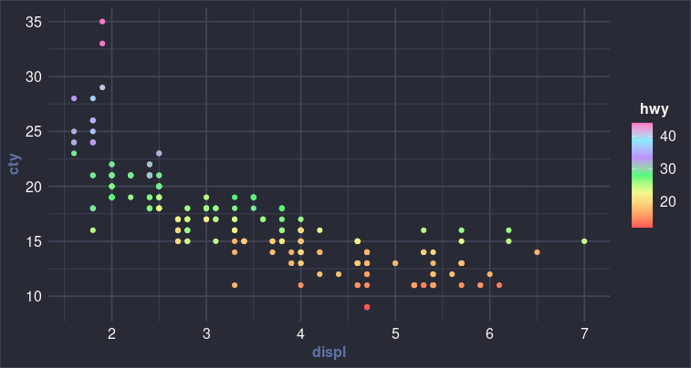

# Dracula for [ggplot2](https://github.com/tidyverse/ggplot2)

A minimal [Dracula theme](https://draculatheme.com/) and palette for [`ggplot2`](https://github.com/tidyverse/ggplot2).

```R
library(ggplot2)
library(dplyr)
theme_set(theme_dracula())

mpg %>%
  group_by(manufacturer) %>%
  summarize(mean_hwy = mean(hwy)) %>%
  ggplot(aes(x = manufacturer, y = mean_hwy, fill = manufacturer)) + 
  geom_col() + theme(legend.position = "none") + coord_flip() +
  scale_fill_manual(
    values   = dracula_palette(
      num_col  = nlevels(factor(mpg$manufacturer)), 
      var_type = "discrete")
  )
```


```R
library(ggplot2)
library(dplyr)
theme_set(theme_dracula())

mpg %>%
  ggplot(aes(x = displ, y = cty, color = hwy)) + 
  geom_point() + 
  scale_colour_gradientn(colors = dracula_palette(var_type = "continuous"))
```



## Install

All instructions can be found at [draculatheme.com/ggplot2](https://draculatheme.com/ggplot2).

## Team

This theme is maintained by the following person(s) and a bunch of [awesome contributors](https://github.com/dracula/template/graphs/contributors).

[](https://github.com/jrdnbradford) |
--- |
[Jordan Bradford](https://github.com/jrdnbradford) |

## License

[MIT License](./LICENSE)